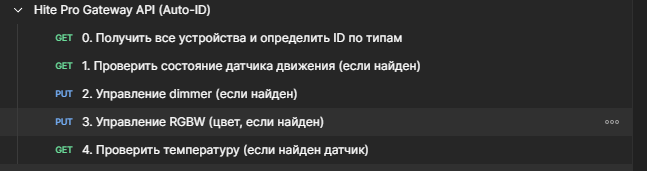
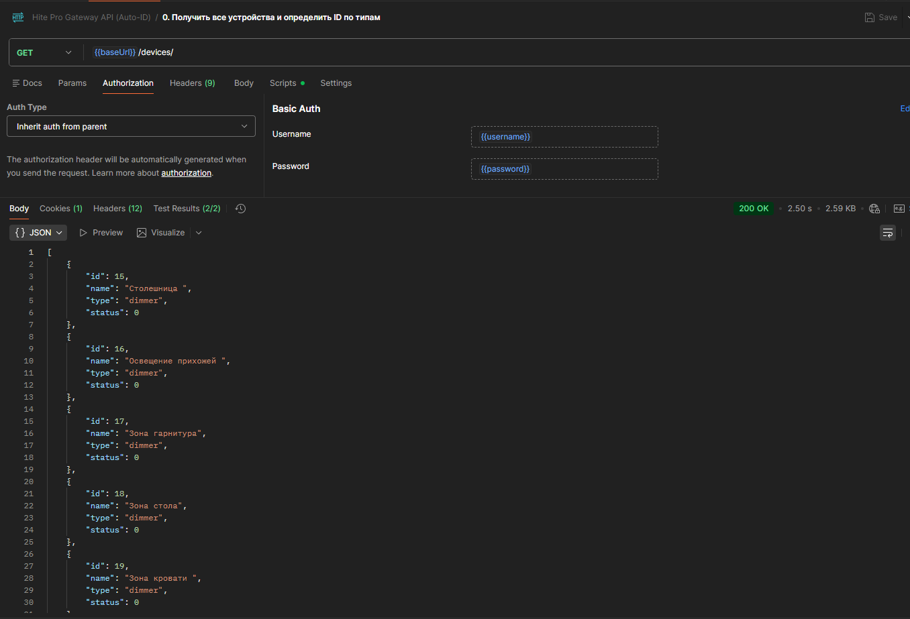
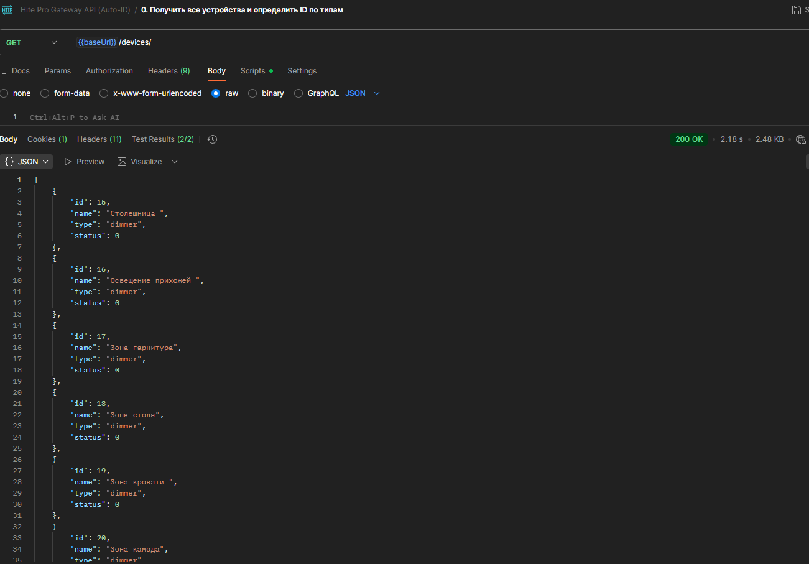
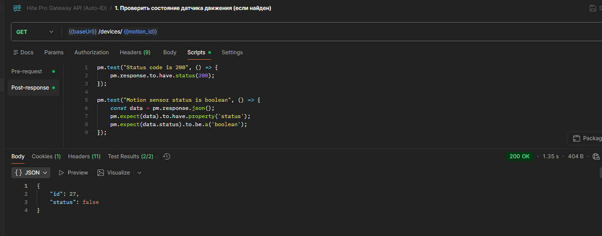
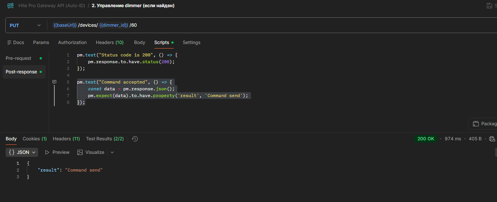
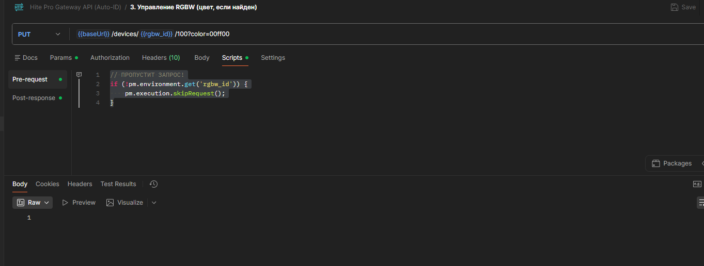
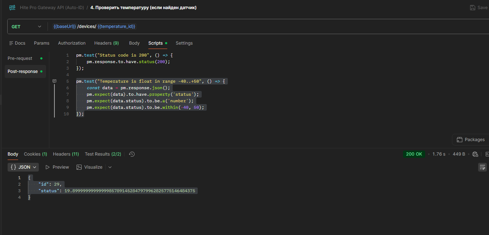

# 🚩 Hite Pro Gateway API — Обучение Postman + Newman

Этот проект создан **для освоения навыков автоматизации API-тестов** с использованием:
- **Postman** — для создания и отладки запросов,
- **Newman** — для запуска из командной строки,
- **GitHub Actions** — для интеграции в CI/CD.

> 💡 Основная цель — не просто проверить шлюз, а **научиться работать с инструментами**.

#### [Покрытие API HiTE PRO Gateway](https://github.com/cheryst24-code-qa/hitepro-api-tests/blob/main/TEST_COVERAGE.md).
---

## 🖼️ Шаг 1: Коллекция в Postman

### 1.1. Структура
Коллекция **«Hite Pro Gateway API (Auto-ID)»** содержит:
- Запрос к `/devices/` для получения списка устройств,
- Автоматическое определение ID по типам (`switch`, `dimmer`, `motion` и др.),
- Условные запросы, которые **пропускаются**, если устройство отсутствует.

  
*Рис. 1: Коллекция в Postman*

### 1.2. Авторизация
- Тип: **Basic Auth**
- Настроена **на уровне коллекции** через переменные:
  - `{{username}}`
  - `{{password}}`

> 🔑 Это означает: **все запросы автоматически получают заголовок `Authorization`** — дополнительные скрипты не нужны.

  
*Рис. 2: Авторизация на уровне коллекции*

### 1.3. Автоматическое определение ID
Первый запрос (`0. Получить все устройства...`) содержит **Post-response Script**, который:
- Парсит ответ `/devices/`,
- Находит первое устройство каждого типа,
- Сохраняет его ID в переменные окружения:  
  `switch_id`, `dimmer_id`, `motion_id`, `temperature_id` и др.

Пример логики:
```js
devices.forEach(device => {
    if (!device.type) return;
    
    const type = device.type;
    let varName = null;
    
    // Определяем имя переменной по типу
    switch(type) {
        case 'switch': varName = 'switch_id'; break;
        case 'dimmer': varName = 'dimmer_id'; break;
        case 'drive': varName = 'drive_id'; break;
        case 'motion': varName = 'motion_id'; break;
        case 'illumination': varName = 'illumination_id'; break;
        case 'temperature': varName = 'temperature_id'; break;
        case 'humidity': varName = 'humidity_id'; break;
        case 'checker': varName = 'checker_id'; break;
        case 'water': varName = 'water_id'; break;
        case 'power': varName = 'power_id'; break;
        case 'transmitter': varName = 'transmitter_id'; break;
        case 'LED':
        case 'LED3S/M':
        case 'RGBW': varName = 'rgbw_id'; break;
        default: return; // игнорируем неизвестные типы
    }
    
    // Сохраняем ID, если ещё не сохраняли
    if (pm.environment.get(varName) === null) {
        pm.environment.set(varName, device.id.toString());
        console.log(`Found ${type} → id=${device.id}`);
    }
});
```
  
*Рис. 3: Получить все устройства и определить ID по типам*


| Последующие запросы содержат **Pre-request Script**, если устройство не найдено — запрос пропускается, а не падает:
  ```js
 // devices_id = motion_id || dimmer_id || rgbw_id || temperature_id
  if (!pm.environment.get('motion_id')) {
      pm.execution.skipRequest();
  }
  ```

### 1.4. Cостояние датчика движения
Запрос (`1. Проверить состояние датчика движения...`) содержит **Post-response Script**, который:
- Проверяет, что в JSON-ответе содержится свойство status с булевым значением (true/false):
```js
  pm.test("Motion sensor status is boolean", () => {
      const data = pm.response.json();
      pm.expect(data).to.have.property('status');
      pm.expect(data.status).to.be.a('boolean');
  });
```
  
*Рис. 4: Cостояние датчика движения*

### 1.5. Управление dimmer
Запрос (`2. Управление dimmer...`) содержит **Post-response Script**, который:
- Проверяет, что в JSON-ответе содержится свойство result со значением 'Command send':
```js
  pm.test("Command accepted", () => {
      const data = pm.response.json();
      pm.expect(data).to.have.property('result', 'Command send');
  });
```
  
*Рис. 5: Управление dimmer*

### 1.6. Управление RGBW
Запрос (`3. Управление RGBW...`) содержит **Post-response Script**, который:
- Проверяет, что в JSON-ответе содержится свойство result со значением 'Command send':
```js
  pm.test("Command accepted", () => {
      const data = pm.response.json();
      pm.expect(data).to.have.property('result', 'Command send');
  });
```
- Пропустить запрос, devices_id не найден
  
*Рис. 5: Управление RGBW*

### 1.7. Проверить температуру
Запрос (`4. Проверить температуру (если найден датчик)...`) содержит **Post-response Script**, который:
- Проверяет, что в JSON-ответе получаем объект. Проверяем существует ли свойство status.
  Проверяем является ли значение data.status числом - number. Проверяем находится ли число в диапазоне
  от -40 до 50 включительно.
```js
  pm.test("Temperature is float in range -40..+50", () => {
      const data = pm.response.json();
      pm.expect(data).to.have.property('status');
      pm.expect(data.status).to.be.a('number');
      pm.expect(data.status).to.be.within(-40, 50);
  });
```
  
*Рис. 5: Проверка температуры*

📦 Шаг 2: Экспорт в JSON
После настройки коллекция экспортирована как:
- hite-pro-collection.json — основная коллекция,
- environment.template.json — шаблон окружения.

|🔍 Вы можете открыть эти файлы в любом редакторе и увидеть структуру тестов.

▶️ Шаг 3: Запуск через Newman

Установка
```bash
  npm install -g newman
```
Локальный запуск
1. Создайте окружение:
```bash
  cp environment.template.json environment.json
```
2. Заполните environment.json:
```json
{
  "key": "baseUrl",
  "value": "https://ваш_ключ.connect-profi.ru/rest"
},
{
  "key": "username",
  "value": "admin"
},
{
  "key": "password",
  "value": "ваш_пароль"
}
```
3. Запустите:
```bash
  newman run hite-pro-collection.json -e environment.json
```
| 💡 Newman читает те же .json-файлы, что и Postman.

🤖 Шаг 4: Интеграция в CI/CD
Добавлен workflow .github/workflows/postman-tests.yml, который:
- Устанавливает Newman,
- Передаёт секреты через --env-var,
- Запускает тесты при пуше и по расписанию.
Пример:
```yaml
  - name: Run API tests
    run: |
      newman run hite-pro-collection.json \
        --env-var "baseUrl=https://${{ secrets.HITE_PRO_KEY }}.connect-profi.ru/rest" \
        --env-var "username=${{ secrets.HITE_PRO_USER }}" \
        --env-var "password=${{ secrets.HITE_PRO_PASS }}"
```
📁 Структура проекта

hite-pro-test-postman/
├── docs/
│   ├── postman-collection.png
│   └── postman-auth.png
├── hite-pro-collection.json
├── environment.template.json
├── .gitignore
└── README.md

🔒 Безопасность
- Никогда не коммитьте environment.json — он содержит пароль.
- Файл .gitignore уже исключает environment.json.
- Используйте environment.template.json как документацию.

📚 Дополнительно
- [Официальная спецификация API (PDF)](./docs/API_HITE_PRO.pdf).
- Полноценная автоматизация на Node.js: [Playwright-версия тестов](https://github.com/cheryst24-code-qa/hitepro-api-tests)


# Hite Pro Gateway API - Автоматизированные тесты

Набор автоматизированных API-тестов для шлюза **Hite Pro** через облачный сервис `connect-profi.ru`.  
Тесты написаны в **Postman**, запускаются через **Newman** и могут быть интегрированы в CI/CD (GitHub Actions).

> 💡 Полноценная автоматизация на Node.js: [Playwright-тесты](https://github.com/cheryst24-code-qa/hitepro-api-tests)

#### [Покрытие API HiTE PRO Gateway](./TEST_COVERAGE.md).

---

## 📁 Структура проекта
hite-pro-test-postman/  
 ├─ hite-pro-collection.json # Основная коллекция Postman  
 ├─ environment.json # Локальное окружение (НЕ коммитится!)  
 ├─ environment.template.json # Шаблон окружения (для примера)  
 ├─ .gitignore # Исключает секреты из Git  
 └─ README.md  

---

## ⚙️ Требования

- [Node.js](https://nodejs.org/) (v18+)
- [Newman](https://www.npmjs.com/package/newman) (CLI для Postman)

Установите Newman:
```bash
npm install -g newman

```
▶️ Запуск локально  
1. Создайте файл environment.json на основе шаблона:  
cp environment.template.json environment.json

2. Отредактируйте environment.json, указав:
- baseUrl: https://<внешний_ключ>.connect-profi.ru/rest
- username / password: учётные данные от шлюза

3. Запустите тесты:  
newman run hite-pro-collection.json -e environment.json

💡 Тесты автоматически определяют ID устройств по типам (dimmer, motion, temperature и др.)  
 и пропускают шаги, если устройство отсутствует.

## 🔒 Безопасность
- Никогда не коммитьте environment.json в Git!
  Он содержит чувствительные данные (внешний ключ, логин, пароль).
- Файл .gitignore уже исключает environment.json.
- Используйте environment.template.json как документацию по переменным.

## 🧪 Поддерживаемые устройства
Коллекция автоматически тестирует:
| Устройство | Типы в API | Действие |
|-----|----------|-----------|
| `Выключатель` | `switch` | `Чтение состояния` |
| `Диммер` | `dimmer` | `Проверка статуса (boolean)` |
| `Датчик движения` | `motion` | `Проверка статуса (boolean)` |
| `Датчик освещённости` | `illumination` | `(резерв)` |
| `Температура` | `temperature` | `Проверка диапазона (-40..+50°C)` |
| `Влажность` | `humidity` | `(резерв)` |
| `RGBW-лента` | `LED, LED3S/M, RGBW` | `Управление цветом (#00ff00)` |

Если устройство не найдено, соответствующий тест падает, поэтому необходимо удалить тест с данным устройством.

## 🔄 Интеграция с CI/CD (GitHub Actions)
Пример .github/workflows/api-tests.yml:
```yaml

name: API Tests
on: [push, pull_request]

jobs:
  test:
    runs-on: ubuntu-latest
    steps:
      - uses: actions/checkout@v4

      - name: Setup Node.js
        uses: actions/setup-node@v4
        with:
          node-version: '20'

      - name: Install Newman
        run: npm install -g newman

      - name: Create environment.json from secrets
        run: |
          cat > environment.json <<EOF
          {
            "id": "ci-env",
            "name": "CI Environment",
            "values": [
              { "key": "baseUrl", "value": "https://${{ secrets.HITE_PRO_KEY }}.connect-profi.ru/rest", "enabled": true },
              { "key": "username", "value": "${{ secrets.HITE_PRO_USER }}", "enabled": true },
              { "key": "password", "value": "${{ secrets.HITE_PRO_PASS }}", "enabled": true }
            ]
          }
          EOF

      - name: Run API tests
        run: newman run hite-pro-collection.json -e environment.json
```
Не забудьте добавить секреты в Settings → Secrets and variables → Actions:

- HITE_PRO_KEY  
- HITE_PRO_USER  
- HITE_PRO_PASS 

## 🛠 Возможные ошибки
| Ошибка | Причина | Решение |
|-----|----------|-----------|
| `ENOTFOUND {{baseUrl}}` | `Неправильное имя переменной или пробелы в environment.json` | `Убедитесь, что ключ = baseUrl, значение без пробелов` |
| `504 Gateway Time-out` | `Сервер не отвечает на запрос к конкретному устройству` | `Проверьте состояние устройства в веб-интерфейсе Hite Pro` |
| `pm.request.abort is not a function` | `Использование устаревшего метода в Newman` | `Используйте pm.execution.skipRequest() (уже применено в коллекции)` |

## 📬 Поддержка
Проект создан для автоматизации проверки работоспособности шлюза Hite Pro.  
Репозиторий: github.com/cheryst24-code-qa/hite-pro-test-postman


