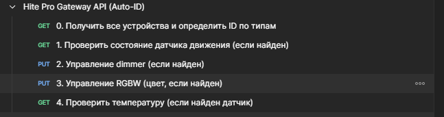
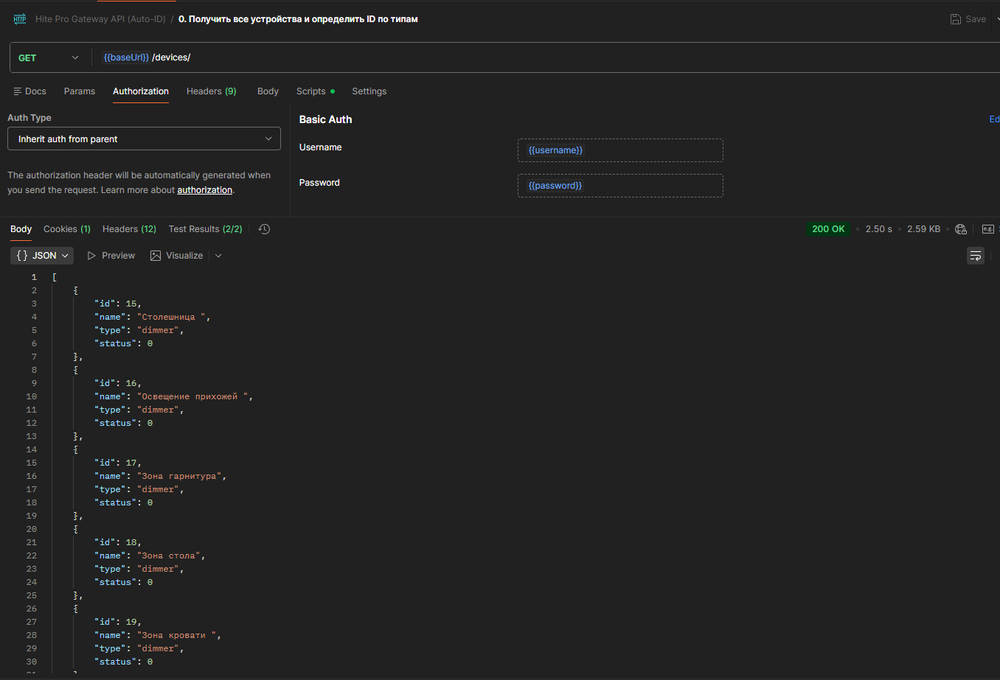
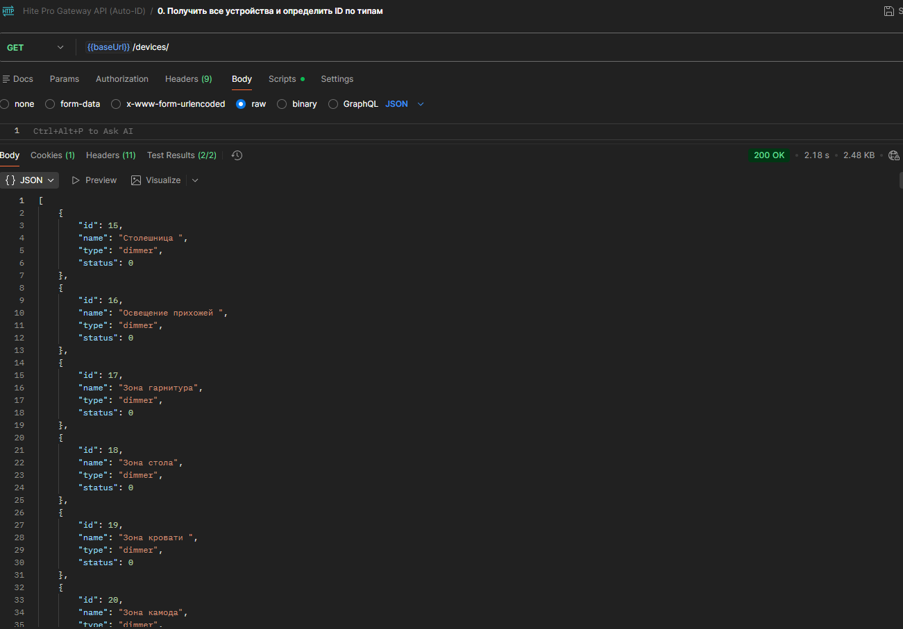
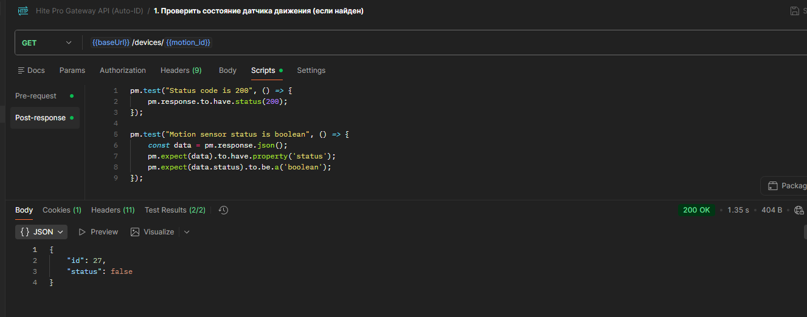
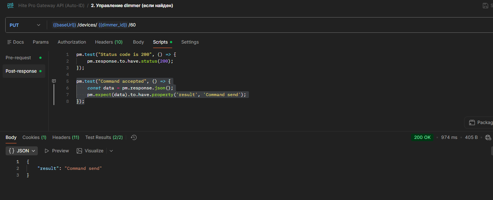
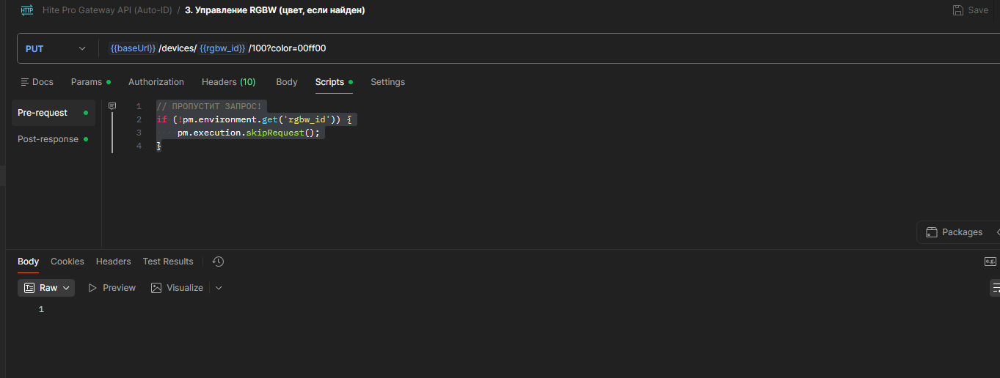
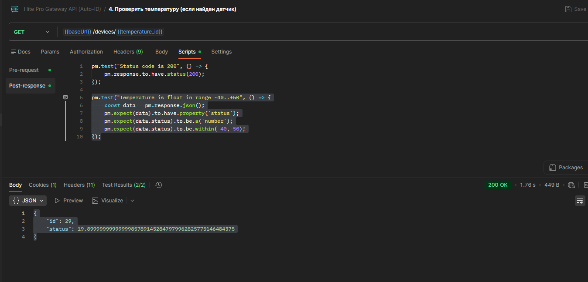
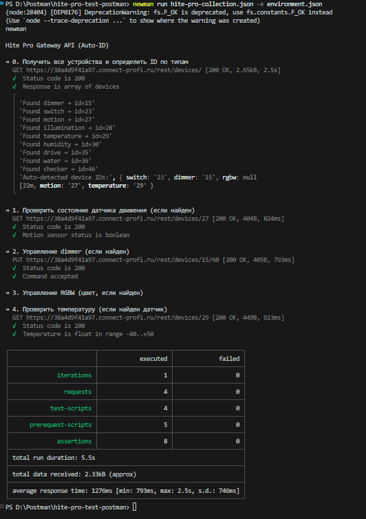

Hite Pro Gateway API - Обучение Postman + Newman

[](LICENSE)

Этот проект создан для освоения навыков автоматизации API-тестов с использованием:
- Postman - для создания и отладки запросов,
- Newman - для запуска из командной строки,
- GitHub Actions - для интеграции в CI/CD.

> Основная цель - не просто проверить шлюз, а научиться работать с инструментами.

---

Шаг 1: Коллекция в Postman

1.1. Структура
Коллекция «Hite Pro Gateway API (Auto-ID)» содержит:
- Запрос к `/devices/` для получения списка устройств,
- Автоматическое определение ID по типам (`switch`, `dimmer`, `motion` и др.),
- Условные запросы, которые пропускаются, если устройство отсутствует.

  

1.2. Авторизация
- Тип: Basic Auth
- Настроена на уровне коллекции через переменные:
  - `{{username}}`
  - `{{password}}`

> Это означает: все запросы автоматически получают заголовок `Authorization` - дополнительные скрипты не нужны.

  

1.3. Автоматическое определение ID
Первый запрос (`0.Получить все устройства...`) содержит Post-response Script, который:
- Парсит ответ `/devices/`,
- Находит первое устройство каждого типа,
- Сохраняет его ID в переменные окружения:  
  `switch_id`, `dimmer_id`, `motion_id`, `temperature_id` и др.

Пример логики:
```js
devices.forEach(device => {
    if (!device.type) return;
    
    const type = device.type;
    let varName = null;
    
    // Определяем имя переменной по типу
    switch(type) {
        case 'switch': varName = 'switch_id'; break;
        case 'dimmer': varName = 'dimmer_id'; break;
        case 'drive': varName = 'drive_id'; break;
        case 'motion': varName = 'motion_id'; break;
        case 'illumination': varName = 'illumination_id'; break;
        case 'temperature': varName = 'temperature_id'; break;
        case 'humidity': varName = 'humidity_id'; break;
        case 'checker': varName = 'checker_id'; break;
        case 'water': varName = 'water_id'; break;
        case 'power': varName = 'power_id'; break;
        case 'transmitter': varName = 'transmitter_id'; break;
        case 'LED':
        case 'LED3S/M':
        case 'RGBW': varName = 'rgbw_id'; break;
        default: return; // игнорируем неизвестные типы
    }
    
    // Сохраняем ID, если ещё не сохраняли
    if (pm.environment.get(varName) === null) {
        pm.environment.set(varName, device.id.toString());
        console.log(`Found ${type} → id=${device.id}`);
    }
});
```
  


> Последующие запросы содержат Pre-request Script, если устройство не найдено - запрос пропускается, а не падает:
  ```js
 // devices_id = motion_id || dimmer_id || rgbw_id || temperature_id
  if (!pm.environment.get('devices_id')) {
      pm.execution.skipRequest();
  }
  ```

1.4. Cостояние датчика движения
Запрос (`1.Проверить состояние датчика движения...`) содержит Post-response Script, который:
- Проверяет, что в JSON-ответе содержится свойство status с булевым значением (true/false):
```js
  pm.test("Motion sensor status is boolean", () => {
      const data = pm.response.json();
      pm.expect(data).to.have.property('status');
      pm.expect(data.status).to.be.a('boolean');
  });
```
  

1.5. Управление dimmer
Запрос (`2.Управление dimmer...`) содержит Post-response Script, который:
- Проверяет, что в JSON-ответе содержится свойство result со значением 'Command send':
```js
  pm.test("Command accepted", () => {
      const data = pm.response.json();
      pm.expect(data).to.have.property('result', 'Command send');
  });
```
  

1.6. Управление RGBW
Запрос (`3.Управление RGBW...`) содержит Post-response Script, который:
- Проверяет, что в JSON-ответе содержится свойство result со значением 'Command send':
```js
  pm.test("Command accepted", () => {
      const data = pm.response.json();
      pm.expect(data).to.have.property('result', 'Command send');
  });
```
- Пропустить запрос, если devices_id не найден

  

1.7. Проверить температуру
Запрос (`4.Проверить температуру (если найден датчик)...`) содержит Post-response Script, который:
- Проверяет, что в JSON-ответе получаем объект. Проверяет существует ли свойство status.
- Проверяет является ли значение data.status числом - number.
- Проверяет находится ли число в диапазоне
  от -40 до 50 включительно.
```js
  pm.test("Temperature is float in range -40..+50", () => {
      const data = pm.response.json();
      pm.expect(data).to.have.property('status');
      pm.expect(data.status).to.be.a('number');
      pm.expect(data.status).to.be.within(-40, 50);
  });
```
  

---

Шаг 2: Экспорт в JSON

После настройки, коллекция экспортирована как:
- hite-pro-collection.json — основная коллекция,
- environment.template.json — шаблон окружения.

> Вы можете открыть эти файлы в любом редакторе и увидеть структуру тестов.

---

Шаг 3: Запуск через Newman

3.1. Установка:
```bash
npm install -g newman
```
3.2. Запуск локально:  

> Тесты автоматически определяют ID устройств по типам (dimmer, motion, temperature и др.)  
> и пропускают шаги, если устройство отсутствует.

3.2.1. Создайте окружение:
```bash
cp environment.template.json environment.json
```
3.2.2. Заполните environment.json:
```json
{
  "key": "baseUrl",
  "value": "https://ваш_ключ.connect-profi.ru/rest"
},
{
  "key": "username",
  "value": "admin"
},
{
  "key": "password",
  "value": "ваш_пароль"
}
```
3.2.3. Запустите:
```bash
newman run hite-pro-collection.json -e environment.json
```
> Newman читает те же .json-файлы, что и Postman.

---



---

Шаг 4: Интеграция с CI/CD (GitHub Actions)
Добавляем workflow .github/workflows/postman-tests.yml, который:
- Устанавливает Newman,
- Передаёт секреты через --env-var,
- Запускает тесты при пуше и по расписанию.

Пример .github/workflows/api-tests.yml:
```yaml
name: API Tests
on: [push, pull_request]

jobs:
  test:
    runs-on: ubuntu-latest
    steps:
      - uses: actions/checkout@v4

      - name: Setup Node.js
        uses: actions/setup-node@v4
        with:
          node-version: '20'

      - name: Install Newman
        run: npm install -g newman

      - name: Create environment.json from secrets
        run: |
          cat > environment.json <<EOF
          {
            "id": "ci-env",
            "name": "CI Environment",
            "values": [
              { "key": "baseUrl", "value": "https://${{ secrets.HITE_PRO_KEY }}.connect-profi.ru/rest", "enabled": true },
              { "key": "username", "value": "${{ secrets.HITE_PRO_USER }}", "enabled": true },
              { "key": "password", "value": "${{ secrets.HITE_PRO_PASS }}", "enabled": true }
            ]
          }
          EOF

      - name: Run API tests
        run: newman run hite-pro-collection.json -e environment.json
```
> Не забудьте добавить секреты в Settings → Secrets and variables → Actions:

- HITE_PRO_KEY  
- HITE_PRO_USER  
- HITE_PRO_PASS 

---

Безопасность
- Никогда не коммитьте environment.json — он содержит пароль.
- Файл .gitignore уже исключает environment.json.
- Используйте environment.template.json как документацию.

---

Дополнительно
- [Официальная спецификация API (PDF)](./docs/API_HITE_PRO.pdf).
- [Полноценная автоматизация на Node.js: Playwright-версия тестов](https://github.com/cheryst24-code-qa/hitepro-api-tests)
- [Покрытие API HiTE PRO Gateway](https://github.com/cheryst24-code-qa/hitepro-api-tests/blob/main/TEST_COVERAGE.md)